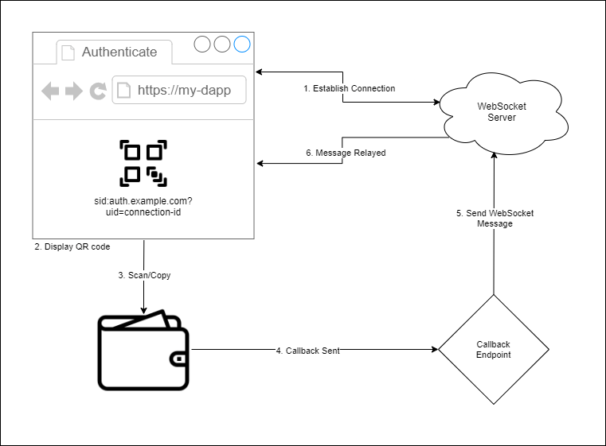

# WebSocket Authentication

You can use Stratis Open Auth Protocol with web sockets, to allow a user to personalise their experience when using your dApp.

## Request Flow

1. Connect to a websocket with a unique session or connection identifier.
2. Build a [Stratis ID URI](../../README.md#stratis-id-uri), using the session or connection identifier as the UID query string. Generate a QR code containing this URI.
3. User scans QR code displayed by the dApp.
4. Respond to a callback request, validating the signature and the wallet address public key. Optionally, generate an auth token for the user.
5. Send a message to the websocket using the session or connection identifier included in the callback.
6. Websocket message relayed back to the client.
  
## Examples
  
- Opdex [[UI](https://github.com/Opdex/opdex-ui) | [API](https://github.com/Opdex/opdex-v1-api)] (uses SignalR)